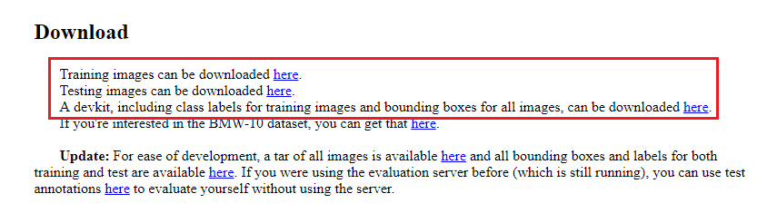
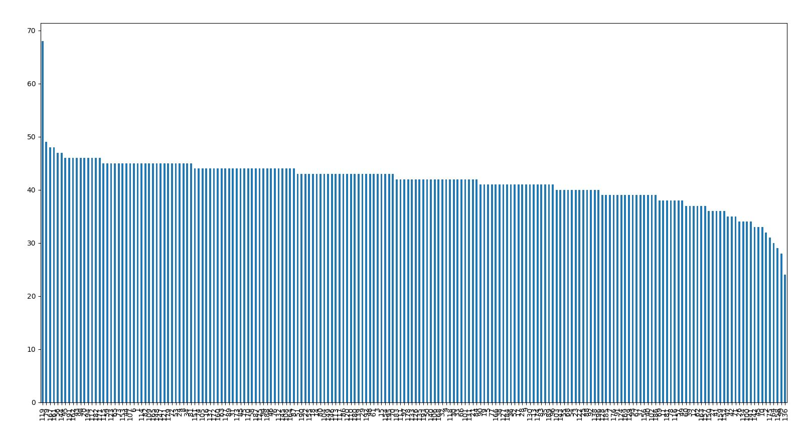
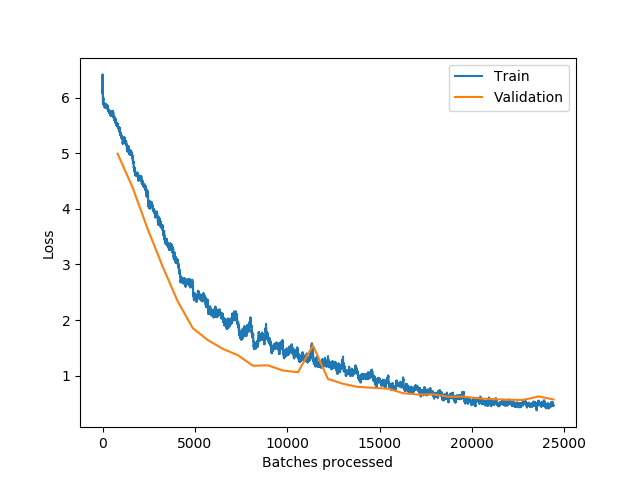
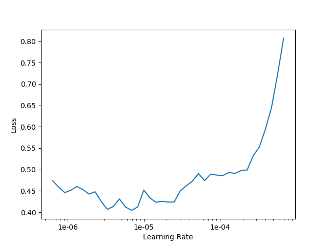
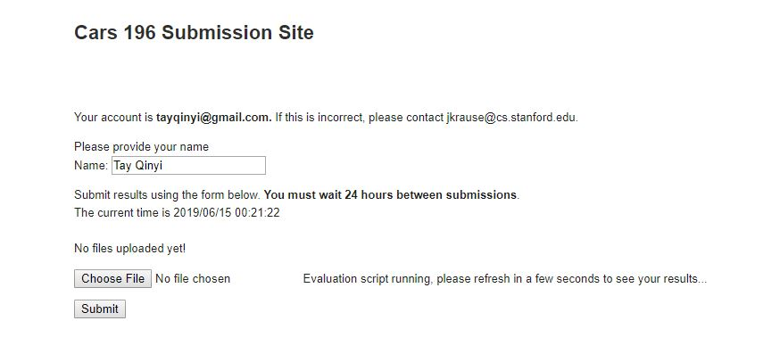

# Stanford cars dataset transfer learning <h2> Abstract 
This repository contains the findings about using transfer learning to adapt a model to perform classification on the 
make and model of cars. The pretrained model **resnet152** is used as the based and we added extra layers at the end 
of it to adapt it to our images. After training, finetuning, the resulting accuracy performed on the test set is
 **88.01%**.
# <h2> Table of contents  
1. [Introduction](#user-content--1-intoduction)
2. [Data exploration](#user-content--2-data-exploration)
3. [Training regime](#user-content--3-training-regime)
   1. [Data import and cropping](#user-content--i-data-import-and-cropping)
   2. [Data transformation and cross validation](#user-content--ii-data-transformation-and-cross-validation)
   3. [Model preparation](#user-content--iii-model-preparation)
   4. [First training](#user-content--iv-first-training)
   5. [Finetuned training](#user-content--v-fine-tune-training)
   6. [Prediction and submission](#user-content--vi-prediction-and-submission)
4. [User guide](#user-content--4-user-guide)
5. [Conclusion](#user-content--5-conclusion)
# <h3> 1. Intoduction
The dataset used is the [Stanford cars dataset](https://ai.stanford.edu/~jkrause/cars/car_dataset.html). I downloaded 
the train, test and devkit.

Export and place them in the project folder in the following structure
```text
\---data
    +---cars_test
        +---00001.jpg
        +---00002.jpg
	...
    +---cars_train
        +---00001.jpg
        ...
    +---devkit
        +---cars_meta.mat
        ...
 ---md
 ---models
 ---predictions
 ---dataimport.py
 ---datasplit.py
 ...
 ---README.md
```
 **Note: This is about it for the setup, if you just wanna run the script, you can skip to [section 4](#user-content--4-user-guide).**
# <h3> 2. Data exploration
<br>
First, a peak into the annos files let us know the data format given. There is going to be a pandas dataframe like  sturctured
which we will flow our images from. The table also contains information about the bounding box of the cars in their images.
Next, we also need to check the classes distribution to determine if there's any data balancing required

The distribution really isn't too bad, so we will leave the data as it is.
That means for **data preparation**, we will:
- Flow the data from dataframe with fname column
- Crop the images according to the bbox columns given and saved them to a different folders
- Split the images into a train test split for cross validation(to ensure no overfitting), we will use **test_ratio=0.2**
# <h3> 3. Training regime
# <h4> i. Data import and cropping
This is done so in the file [dataimport.py](dataimport.py). Below is an image comparison before and after cropping

 Original             |  Cropped
:-------------------------:|:-------------------------:
  | 
# <h4> ii. Data transformation and cross validation
This is done so in the file [datasplit.py](datasplit.py).
```text
preprocess = get_transforms()
test = ImageList.from_df(test_df, test_dir, cols='fname')
train = (ImageList.from_df(train_df, train_dir, cols='fname')).split_by_rand_pct(valid_pct=testratio, seed=50).label_from_df(cols='class').add_test(test)
data = (train.transform(preprocess, size=imagesize)
        .databunch()
        .normalize(imagenet_stats))
data.batch_size = batchsize
```
In the above code, we create 'generators' to retrive data from train and test dataframes. we then split the train set into
train and validation set by the specified ratio (default=0.2). We also applied transformation (zoom, flip, etc) and normalize the
image gradient to normalize the pixels impact. For those that are not familiar with fastai dataset. The data object 
now contains 3 datasets inside:
```text
>>> data.train_ds, data.valid_ds, data.test_ds
(LabelList (6516 items), (LabelList (1628 items), (LabelList (8041 items)) 
```

# <h4> iii. Model preparation
This is done so in the file [learnerbuild.py](learnerbuild.py)

```text
base_model = models.resnet152
callbacks = [partial(EarlyStoppingCallback, monitor='valid_loss', min_delta=0.01, patience=8)]
learn = cnn_learner(data, base_model, metrics=[error_rate], callback_fns=callbacks)
```
In this setup, we will the pretrained resnet152 as our base model, add a few layers after it to adapt it to our classification. 
We also added an Early stopping callback monitoring validation loss to prevent overfitting. Below is a small snapshot of the model summary:
```text
Sequential
======================================================================
Layer (type)         Output Shape         Param #    Trainable 
======================================================================
Conv2d               [64, 112, 112]       9,408      False     
______________________________________________________________________
BatchNorm2d          [64, 112, 112]       128        True      
______________________________________________________________________
ReLU                 [64, 112, 112]       0          False     
______________________________________________________________________
MaxPool2d            [64, 56, 56]         0          False     
```
As can be seen, most of layers are not trainable/frozen except BatchNorm2d.
# <h4> iv. First training
For the first training, we do it with default hyperparameters and give a large epochs so that it can keep training, 
we will rely on EarlyStopping to detect when the training is no longer improving the model. During my run after about 
30 epochs, we get the following results:

epoch | train_loss | valid_loss | error_rate | time
--- | --- | --- | --- | ---
0 | 5.506438 | 4.993631 | 0.964373 | 05:10     
1 | 4.930608 | 4.384122 | 0.889435 | 04:58     
2 | 4.266478 | 3.639033 | 0.751843 | 05:04     
3 | 3.651903 | 2.962635 | 0.647420 | 05:17     
4 | 3.083017 | 2.336170 | 0.544840 | 05:07     
5 | 2.650666 | 1.854763 | 0.451474 | 05:05     
6 | 2.300126 | 1.639489 | 0.409091 | 05:05     
7 | 2.100447 | 1.481063 | 0.367936 | 05:06     
8 | 1.919847 | 1.367549 | 0.353808 | 05:07     
9 | 1.709594 | 1.177967 | 0.303440 | 05:06     
10 | 1.757606 | 1.184764 | 0.303440 | 05:06     
11 | 1.488935 | 1.091771 | 0.293612 | 05:04     
12 | 1.410809 | 1.059965 | 0.275799 | 05:07     
13 | 1.387043 | 1.542177 | 0.298526 | 05:05     
14 | 1.352265 | 0.939426 | 0.252457 | 05:05     
15 | 1.336027 | 0.852492 | 0.225430 | 05:05     
16 | 1.032693 | 0.796461 | 0.208231 | 05:08     
17 | 0.998848 | 0.780795 | 0.206388 | 05:18     
18 | 0.997983 | 0.765310 | 0.198403 | 05:17     
19 | 0.950053 | 0.683487 | 0.179361 | 05:11     
20 | 0.782920 | 0.658431 | 0.172604 | 05:12     
21 | 0.684390 | 0.663369 | 0.174447 | 05:12     
22 | 0.580004 | 0.620787 | 0.158477 | 05:09     
23 | 0.673740 | 0.621174 | 0.159091 | 05:14     
24 | 0.575732 | 0.591690 | 0.155405 | 05:12     
25 | 0.565011 | 0.574709 | 0.149263 | 05:17     
26 | 0.511615 | 0.565591 | 0.149877 | 05:17     
27 | 0.510080 | 0.561429 | 0.144963 | 05:14     
28 | 0.513708 | 0.626043 | 0.162776 | 05:11     
29 | 0.467615 | 0.570266 | 0.142506 | 05:12 |

Loss plot<br>

<br>
Looking at both the training history and losses plot above, the model trained decently well. The final accuracy of the
train test validation is at **(1 - error_rate) ==> (1 - 0.142506)** which got us to the accuracy of **85.75%**<br>
We can also take a look at the loss plot and see that both validation and training losses decrease at the same rate, 
showing no sign of overfitting. However, there are a few things we may do to further finetune the model.

# <h4> v. Fine tune training
I fine tuned the model by adjusting the learning rate, which is the most impactful hyperparameter. To do this, I used the 
lr_find in the fastai library:
```text
learner.unfreeze()
learner.lr_find()
learner.recorder.plot()
```

Looking at the loss vs learning rate plot, we want to locate the section for which the loss declines or stays the same, 
seemed to be in the range of (1e-6, 1e-4). Now we fit the model again with the new learning rates. The slice method distributed
the learning rates range across the layers in the network:
```text
lrs = slice(1e-6, 1e-4)
learnerfit.learn_fit(learner, MODEL_PATH, EPOCHS, lrs)
```
We get the following results:

epoch|train_loss|valid_loss|error_rate|time
:-----:|:-----:|:-----:|:-----:|:-----:
0|0.448493|0.558452|0.146192|06:54
1|0.531526|0.566870|0.145577|06:43
2|0.504912|0.578037|0.155405|06:43
3|0.588912|0.574732|0.153563|06:44
4|0.518589|0.572812|0.146806|06:45
5|0.501655|0.588574|0.157862|06:45
6|0.574097|0.576374|0.160319|06:49
7|0.491169|0.562954|0.151106|06:54
8|0.426365|0.576896|0.152334|06:51
9|0.412379|0.542437|0.151106|06:44
10|0.368797|0.539593|0.147420|06:52
11|0.348959|0.517515|0.137592|06:49
12|0.329214|0.512681|0.140049|06:46
13|0.304751|0.502846|0.125307|06:47
14|0.289668|0.489356|0.126536|06:57
15|0.240541|0.487552|0.124693|06:54
16|0.256081|0.506890|0.125307|06:44
17|0.250703|0.488750|0.122850|06:42
18|0.229645|0.489429|0.128378|06:44
19|0.218732|0.485684|0.119779|06:38

As we can see, the accuracy has been improved to **88.01%**.
There are a few more things we may do such as mixup, upscaling, etc., but we will come back to those in a later date.
# <h4> vi. Prediction and submission
For testing, we use the model to predict on the test dataset by doing
```text
learner.get_preds(DatasetType.Test)
```
The result will be parsed and written to a new file in the predictions folder. We can then submit it to the stanford
submission link. This is [my link](http://imagenet.stanford.edu/internal/car196/submission/submission?p=b49b6dd38c944ca03ed02686917045f5) and a snapshot of the results.

# <h3> 4. User guide
The execution is done through [main.py](main.py). The file takes 3 arguments:
```text
--crop      Whether we would crop the image and save to the cropped image folder (only need this as true for the first time)
--train     Whther we would perform training
--finetune  Whether we would finetune the model
```
By default, they are all false, when [main.py](main.py) is executed without any arguments. It would try to load the latest model
in the models folder and run prediction on the test data. 
To download the model that provides the results in this repo, please visit [this link](https://drive.google.com/drive/folders/1WIk1GdJ82o9ZUZLeaV0jGsHlyRMdz9kf) and afterwards place the model in the models
folders.
```text
\---data
 ---md
 ---models
    +---20190616-030705.pth
 ---predictions
 ---dataimport.py
 ---datasplit.py
 ...
 ---README.md
```
So here is exactly how one gets [main.py](main.py) to run:
1. Clone the repo, create folders **models**, **data**
2. Download the data from stanford site and extract them into the **data** folder
3. From here there are two options:
   1. Train the model with main.py, you would do (finetune is optional)
      ```text
      python main.py --crop=True, --train=True, --finetune=True
      ```
   2. Use the final model that I trained, please download it from my [google drive](https://drive.google.com/drive/folders/1WIk1GdJ82o9ZUZLeaV0jGsHlyRMdz9kf) and place it in the models folder
      ```text
      python main.py --crop=True
      ```
After the script finished running, you may take the latest files in the predictions folder and either submit or study them.
To study the model more, in the interactive console, you may do:
```text
learner.summary()
```
to get the model statistics.
# <h3> 5. Conclusion
Transfer learning is such a powerful technique, it gets us decently good results with limited number of samples and training
time. Thanks to it, we are able to get a decent result (**88.01%**) on the stanford cars dataset in a short time.
