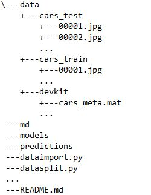

# Stanford cars dataset transfer learning <h2> Abstract 
This repository contains the findings about using transfer learning to adapt a model to perform classification on the 
make and model of cars. The pretrained model **resnet152** is used as the based and we added extra layers at the end 
of it to adapt it to our images. After training, finetuning, the resulting accuracy performed on the test set is
**85.37%**.
 
 
# <h2> Table of contents  
1. Introduction
2. Data exploration
3. Training regime
   1. Data import and cropping
   2. Data transformation and cross validation
   3. First training
   4. Finetuned training
   5. Prediction and submission
4. Results
5. Script execution
# <h3> 1. Intoduction
The dataset used is the [Stanford cars dataset](https://ai.stanford.edu/~jkrause/cars/car_dataset.html). We downloaded 
the train, test and devkit.

Export and place them in the project folder in the follwing structure
 
 

  
 **Note: This is about it for the setup, if you just wanna run the script, you can skip to [section 5](#h3-5-script-execution).**
# <h3> 2. Data exploration

# <h3> 5. Script execution
# Place 2